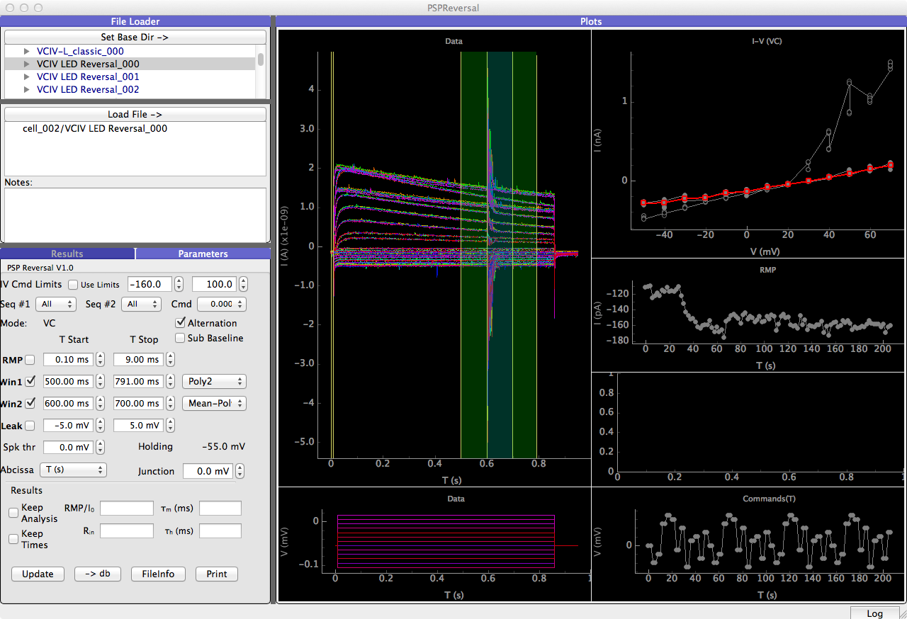
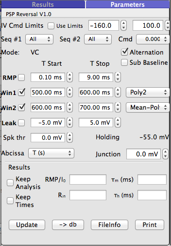
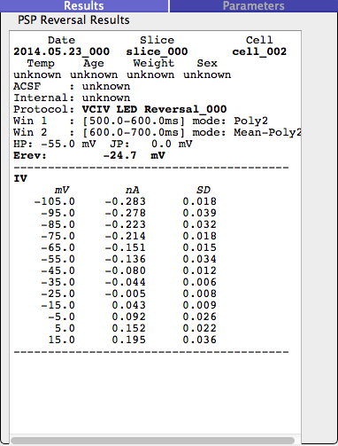

PSP Reversal
============

When attempting to identify the ion species that permeate an ion channel or the channels associated with neurotransmitter receptors
it is common to measure the "reversal" potential, or equilibrium potential, Ei, of the current permeating the receptor under
conditions of different ion concentrations on either side of the membrane. These measurements are usually made in voltage clamp
by varying the cell voltage through a series of steps, while also activating the receptors by stimulating presynaptic cells, or while
measuring the "tail" currents at varying voltages after activation of the receptors. A confounding problem that often
appears in such measurements is that voltage gated ion channels are also activated, and are not at "steady-state" at the
time that the current measurements are being made.

This module is designed to estimate, by interpolation, the equilibrium potentials, in the presence of interfering voltage-gated
currents. A typical task will consist of presenting the cell a range of voltage steps, at least 0.5 seconds in duration, and
providing presynaptic stimulation near the end of the step when the currents are not changing rapidly. Even with Cs-based
pipettes, substantial voltage-gated outward currents, over 2 nA, may appear. If the currents are steady over time, then
a simple subtraction of the voltage-gated current from the evoked current may be sufficient to obtain an uncontaminated
measurement of the evoked current. However if the currents are not at steady state, then the current waveform must be
interpolated and subtracted from the evoked current. There are 2 ways to do this. The first is to use a protocol that
alternates evoked stimulation and no stimulation, with the same current steps. In theory, the alternate traces can be
subtracted from one another. However, this depends on the stability of the voltage-gated current over time, which is not
guaranteed. With the long steps needed to make the measurements, inactivation of the current may occur, even with fairly
long inter-stimulus intervals (> 5 sec), so that the subtraction leads to an inaccurate estimate. The second is to take the
current trace with the evoked response, and to make a measurement both before and after the evoked response, fit this to
a function (such as a line, exponential, or 2nd order polynomial), and subtract the function from the data. This has the
advantage that the current is more accurately estimated from the specific trace being measured, and that no additional
noise is introduced into the measurement because the fit trace is essentially noiseless.

The basic procedure is to read the data, define the two measurement windows, perform the calculations, and print the results.

The PSPReversal module uses a standard layout, similar to that of the IVCurve module. The left side of the window consists of
(top) the file structure and protocols, a **"load"** button, a list of loaded protocols, and below this, two tabbed interfaces.
One interface controls the analysis ("Parameters"), and the other is a read-only text box that holds the results. On the right are
two columns of plots. The left column shows the current traces (top), along with the "linear region" windows (*red* for baseline,
*green* for the reference window, and *blue* for the measurement window), and the command traces (bottom). The right column
has the measured current-voltage relationships for the windows, and the difference plot (top), the holding current during
the protocol (middle), and the voltage commands as a function of time (bottom).

   Figure 1: The PSP Reversal Analysis Module Window has a file reader (left, top), controls and outputs (left, bottom), and multiple
   plots that show the data, ancillary information, and analysis results.

Controls
--------

   Figure 2: The PSP Reversal Analysis Module Window parameter control Panel.

The Parameters panel controls the analysis steps. Several of the controls in this panel have been inherited from the IVCurve
module, and are inactive or should not be used. These include *Seq#1, Seq#2, CMD, Spike Thr (threshold), and IV Command Limits*.

The basic usage is as follows:

If the **Alternation** checkbox is selected, then it is assumed that the data were collected in alternation mode. This affects
the subsequent analysis.

**RMP** establishes the window to measure the resting membrane potential or holding current. Normally this will not be set.

**Win1** sets the start and end times for the first window (green), also called the *"reference"* window. This window is used to establish
which region of the data in the Data plot will be used to establish the baseline. Note that if the window overlaps
with the second window (blue), then the data in the blue region is excluded from the reference measurement.  To the right is a drop down list with
the different kinds of measurements that can be taken from this window. These include the mean, minimum, maximum, "linear" (
line fit to the window), "Poly2" (second order polynomial fit to the window") and "Abs" (largest of the min or max withing
the window. Most of the time, depending on the data, you will use "mean", "linear", or "poly2" for this window. Measurements
are made for each trace.

The window region (time range) can be set by typing in values into the boxes in the control panel, or by dragging the control lines with the
mouse in the data window itself.

**Win2** sets the start and end times for the second window (blue), also called the measurement window. This window is used
to establish where the measurement region will be, and what kind of measurement will be made. The measurements the same
as for window 1, with the addition of "Mean-linear" and "Mean-Poly2". These latter modes use fits to the data in the
measurement window (window 1) to establish a baseline within window 2. The baseline is subtracted, point-by-point in time, from
the data in window 2. This results in more accurate estimates of the
amplitude, mean, etc. of events in window 2.

**Leak** sets the start and end times of the "leak" window, as set in the IV plot (top right). This will not
normally be used in the PSP analysis.

**Abcissa** determines the abcissa values for the time-course plot for the holding current/RMP.

**Holding** reports the holding potential (in voltage clamp) used in the selected protocol.

**Junction Potential** allows the user to set a junction potential value in the anlaysis. This value is reported in the
results window as well.

Below the horizontal line are *"Results"*. These are not used in the present analysis.

Below the unused boxes there is a row of 4 buttons.

    **Update**: The update button recalculates the IV curves, and should be clicked to ensure that the
    analysis is current.

    *-> db*: The database storage button puts information into the sql database (if open). This button is not active.

    *Fileinfo*: This button is not active.

    **Print**: Print the results of the analysis to the "Results" panel. This includes information about the data set
    that was analyzed, the reversal potential estimate, and the IV curve of the evoked response.

Typical Analysis Steps
----------------------

The analysis steps with this module are straightforward.
    1. First, find the data set that you want to analyze, and load it. The data
    should be displayed on the right.
    2. Make sure **Win1** and **Win2** are checked, and adjust the times as appropriate for your data. Default times are
    selected by the program based on the stimulus time ("LED-Blue").
    3. Select the type of measurement to be made in the drop-down list to the right. For **Win1**, This usually will be "mean" if the currents are
    at steady state before the evoked response; otherwise "linear" or "Poly 2 is appropriate. For **Win2**, use the
    subtraction appropriate for the data in **Win1** (e.g., Mean-Linear, or Mean-Poly2).
    4. Click the **"Update"** button to recalculate the IV curves
    5. Click the **"Print"** button to print the results to the *"Results"* panel.

Note that this analysis module handles data that has been recorded with random orders of voltage steps (see the lower right
panel in Figure1), as well as with repeats within the protocol (the protocol in Figure 1 was repeated 4 times).

Output
------

   Figure 3: The PSP Reversal Analysis Results Window shows the results of the analysis, and can be copied to the clipboard to insert
   into other analysis programs.

The output results include all of the basic information about the experiment (assuming that it has been filled in; in this
example, the operator did not provide this information during the experiment, so we will have to go look it up). Below this
are the measurement windows that were used, along with the measurement. Next, the holding and junction potential used
for the calculations are indicated. The reversal potential is found by fitting the current-voltage relationship to a
second-order polynomial, and solving for the roots (I = 0). The estimated reversal potential (assuming that one was found) is listed next; if no
reversal was found within a reasonable voltage range, then the roots, if any, of the fit are reported. Finally, there is a
table of the command voltage, evoked current, and the standard deviation across trials of the evoked current.

The information can be copied from this window using "Ctrl-A" to select all, and "Ctrl-V" to copy to the clipboard (use "command-A"
and "command-V" on Mac systems). Alternately, you can use the mouse to highlight the relevant parts, and copy the data to
another program.
