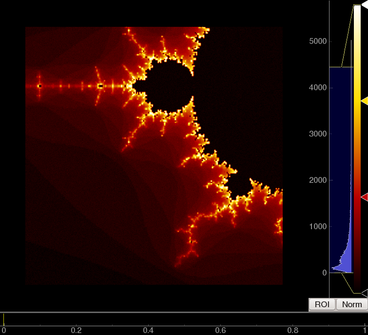

Image viewers
=============

* Supports 2D or 3D data of any numerical type
* Zoom/pannable view of image using same mouse interaction as plots.
* Level mapping controls--set the numerical range of your data that maps to the range of colors on screen.
* Color lookup tables and editable color gradient
* ROI for measuring average image value across time or space
* Normalization routines useful for analyzing video
