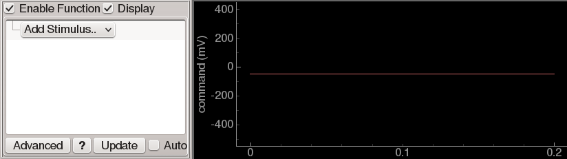
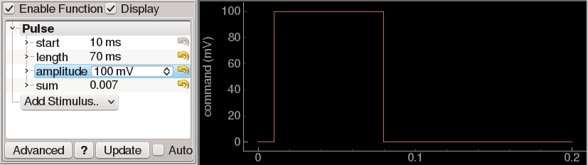
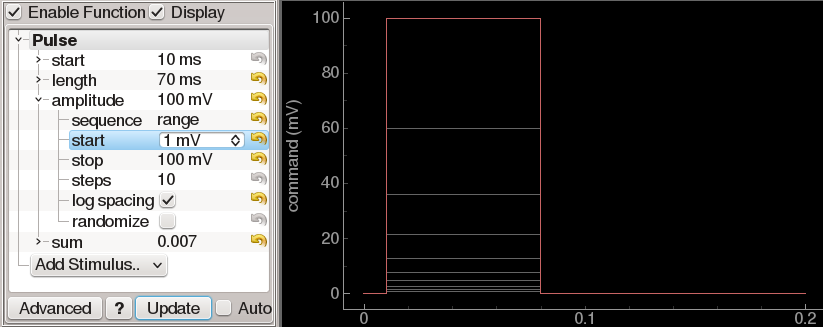
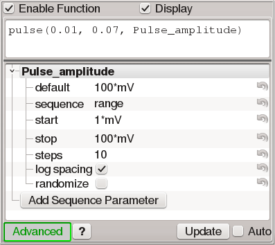

User interface elements
=======================

Several user interface elements are reused throughout ACQ4. In this section we describe these elements and their basic usage.

Plots
-----

Plotting, video, and most other scientific graphics in ACQ4 are provided by `PyQtGraph <www.pyqtgraph.org>`_.

* Automatic scaling to fit data nicely within the plot area
    * Pan-only scaling, allowing the view to recenter on new data as it is displayed, without changing the scale
    * Scaling to percentile to ignore outliers
* Interactive zoom/pan
* Axis linking
* FFT, log transforms
* Averaging
* Downsampling

Image viewers
-------------

* Supports 2D or 3D data of any numerical type
* Zoom/pannable view of image using same mouse interaction as plots.
* Level mapping controls--set the numerical range of your data that maps to the range of colors on screen.
* Color lookup tables and editable color gradient
* ROI for measuring average image value across time or space
* Normalization routines useful for analyzing video

Function generators
-------------------

Many situations in ACQ4 ask the user to define a waveform that will be sent to an analog or digital channel on a :ref:`DAQ device <userDevicesNiDAQ>`. For this purpose, ACQ4 uses a general-purpose function generator control accompanied by a plot displaying the output of the generator:

Function generators have two modes of operation: *simple* and *advanced*. The simple mode allows the construction of waveforms by selecting one or more elements to add to the waveform and adjusting the parameters for each element. 

Function generators are also used to design sequences of waveforms with one or more parameters that vary for each point in the sequence. In simple mode, each of the paraneters that define a waveform element may be expanded to reveal a set of sequencing controls that determine whether and how a parameter should be handled in a sequence:

The advanced mode allows the user to enter a Python expression that will be evaluated to yield the waveform output:

[Note about units]

[Note about the major differences between simple and advanced mode]

File loaders
------------

